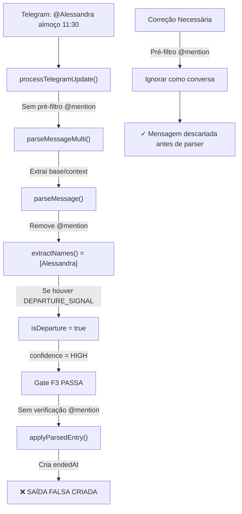

# Análise: Falso Positivo no Caso Marini/Alessandra

**Data da análise:** 10/04/2026  
**Data do incidente:** ~07/04/2026 (conforme audit)  
**Tipo:** Saída falsa por menção (@mention)  
**Severidade:** CRÍTICA (ocupação criada sem comando explícito)

---

## O Incidente

> "José Marini só marcou o perfil de Alessandra para ela ver a vez dela de decidir almoço e o robô achou que era um saindo. Nada de saída explícito"

### What happened
1. **Ação real:** José Marini notificou Alessandra sobre sua vez na divisão de almoço
2. **Método:** Mencionou perfil dela (provavelmente `@Alessandra` ou reply contendo seu nome)
3. **Resultado:** Bot registrou uma **SAÍDA** para Alessandra
4. **Problema:** Não havia comando de saída, nem contexto de saída — apenas uma notificação

### Impacto Operacional
- Ocupação falsa criada em Alessandra
- Correção manual necessária (`/retirar` ou similar)
- Cascata de zero-duration occupancies possível (se outro médico ocupou a base depois)

---

## Causa Raiz: Três Camadas de Falha

### 1. **@Mention Não Detectada Antes do Parser** — P6a

#### Código Atual (Errado)
```typescript
// modules/telegram/service.ts ~ linha 5900
const parsed = parseMessageMulti(message.text);  // Processa @mention normalmente

// extractNames() em parser.ts remove @mention
.replace(/@\w+/g, " ")  // Remove @mention apenas DEPOIS de já estar parseando
```

#### O Problema
- `@Alessandra` é removida em `extractNames()`, permanece `Alessandra` como nome extraído
- Se houver base/ramal ou DEPARTURE_SIGNAL antes/depois, o parser dispara
- Parser não sabe que era conversação, trata como mensagem operacional

#### Formato Provável da Mensagem
```
@Alessandra vê sua vez almoço / Alessandra, você deu 11:30 / 
Alessandra olha lá o seu horário pra almoço — 11:30
```

### 2. **DEPARTURE_SIGNALS Ambíguo** — P3a

#### Palavra-Chave Disparada
Possível que a mensagem continha uma palavra de DEPARTURE_SIGNALS:
- `SAINDO` — em contexto diferente
- `LIBERADO` — se contexto era "chefia liberou"
- `DESCENDO` — se contexto era locação

#### Regex Atual em parser.ts L52:
```typescript
const DEPARTURE_SIGNALS = [
    /\b(?:SAINDO|SAIU|SAI|SAIDA|SAÍDA|ENCERRANDO|ENCERREI|...)$/i,
```

**Problema:** Regex busca por word boundary `\b`, então mesmo em contexto irrelevante faz match.

### 3. **NAME_NOISE_TOKENS Incompleto** — P4

#### Token Faltante
`PERFIL` não está em `NAME_NOISE_TOKENS`.

Se a mensagem era: `Marini marcou PERFIL Alessandra`
- `extractNames()` tokeniza: `["MARINI", "MARCOU", "PERFIL", "ALESSANDRA"]`
- `MARINI`, `MARCOU`, `ALESSANDRA` são testados contra NAME_NOISE_TOKENS
- **`PERFIL` não está listado** → poderia contaminar a extração dependendo da ordem

#### Atual (parser.ts L86-L99):
```typescript
const NAME_NOISE_TOKENS = new Set([
    "A", "AO", "AOS", "AS", ..., "ALMOCO", "DESCANSO",
    // FALTAM:
    // "PERFIL", "MARCOU", "MARCA", "TAG", "NOTIFICA", ...
]);
```

---

## Por Que a Detecção Falhou em Cada Gate

### Gate F1 — `parseMessage()` em Modo Agressivo
✗ **Falhou:** Parser em pré-análise detectou base/ramal (se estivesse na context de almoço)

### Gate F3 — Low Confidence Filter
✗ **Falhou:** Se `confidence === "HIGH"` (porque extractedNames foi populado), F3 deixa passar

```typescript
// service.ts ~ L6047
// Gate F3:
if (parsed.confidence !== "HIGH" && !isDeparture) {
    // BLOQUEIA se não HIGH E não departure
    // MAS: Se extractedNames.length > 0 && baseCode, confidence = HIGH → passa!
}
```

### Gate "Should Use Sender Fallback"
✗ **Falhou (P3c):** Mensagem com @mention retorna false para sender fallback:

```typescript
// service.ts ~ L1200
function shouldUseTelegramSenderNameFallback(messageText: string, senderName: string | null) {
    // ... 
    if (/@/.test(messageText)) {
        return false;  // ← NÃO faz fallback
    }
    // Mas NÃO ignora a mensagem inteira! Continua parseando normalmente
}
```

**Efeito:** Parser continua com `isDeparture = true` + `extractedNames = [...]`

---

## Diagnóstico da Pipeline de Processamento



---

## Solução Completa (Prioridade)

### P0 — IMEDIATO (Hoje)
Adicionar pré-filtro `@mention` **antes** de `parseMessageMulti()`:

```typescript
// modules/telegram/service.ts ~ linha 5850
async function processTelegramUpdate(update: TelegramUpdate) {
    const message = update.message;
    if (!message?.text) return;

    // ← NOVO: PRÉ-FILTRO @MENTION
    if (/@\w+/.test(message.text) && !message.text.startsWith('/')) {
        // Mensagem tem @mention inline (não é comando)
        // Parse rápido para verificar confiança
        const quickParse = parseMessage(message.text);
        
        if (quickParse.confidence !== "HIGH") {
            // Baixa confiança + @mention = conversa, não operacional
            await markTelegramProcessed(log.id, {
                status: "ignored",
                reason: "casual_at_mention_low_confidence",
            });
            return;
        }
        
        // Se HIGH confidence mesmo com @mention, permite passar
        // (raro, mas cobre casos como "@BotName 1367 SD 07:00")
    }

    // Continua pipeline normal...
    const parsed = parseMessageMulti(message.text);
    // ...
}
```

### P1 — Curto Prazo (Hoje/Amanhã)

1. **Expand NAME_NOISE_TOKENS** (parser.ts L86+):
```typescript
const NAME_NOISE_TOKENS = new Set([
    // ... existing ...
    "PERFIL", "MARCOU", "MARCA", "TAG", "NOTIFICA",  // ← NOVO
    "MENCIONA", "TAGGED", "TAGEOU",
]);
```

2. **Refine DEPARTURE_SIGNALS** (parser.ts L52):
```typescript
// Remove RENDI (ambíguo)
// Adicione contexto explícito:
const DEPARTURE_SIGNALS_EXPLICIT = [
    /\b(?:FUI|SENDO)\s+RENDID[OA]\b/i,  // "fui rendido" = saída
    /\b(?:SAINDO|SAIU|SAI|SAIDA)\b/i,   // Mantém outros
];
```

### P2 — Médio Prazo (Próxima Sprint)

1. Move F3 para DEPOIS de sender name resolution
2. Add explicit logging de @mention encounters
3. Add test cases para este cenário (veja abaixo)

---

## Teste Proposto

### Test Case 1: @Mention Ignored
```typescript
test("ignora mensagem @mention conversacional (P6a)", () => {
    // Simular: José marcando perfil de Alessandra
    const text = "@Alessandra vê sua vez almoço 11:30";
    const result = processTelegramMessage({
        text,
        senderTelegramId: "1438288563",  // José/Caio
        messageId: "test-msg-1",
    });
    
    assert.equal(result.status, "ignored");
    assert.match(result.reason, /casual_at_mention/);
    // Não deve criar occupancy
});
```

### Test Case 2: @Mention with High Confidence Allowed
```typescript
test("permite @mention com base+hora explícita (P6a exemption)", () => {
    // Caso extremo: "@bot PM40 SD 07:00" é operacional válido
    const text = "@bot PM40 SD 07:00";
    const parsed = parseMessage(text);
    
    assert.equal(parsed.confidence, "MEDIUM");  // Sem nome, confidence < HIGH
    // Deve ser bloqueado por F3 mesmo sem @mention filter
});
```

### Test Case 3: PERFIL in Noise Tokens
```typescript
test("não extrai PERFIL como nome (P4)", () => {
    const parsed = parseMessage("Marini marcou PERFIL Alessandra para almoço");
    
    // Antes: extractedNames = ["PERFIL", "ALESSANDRA"] ❌
    // Depois: extractedNames = ["ALESSANDRA"] ou [] ✓
    assert(!parsed.extractedNames[0]?.includes("PERFIL"));
});
```

---

## Efeito Esperado Pós-Correção

| Cenário | Antes | Depois |
|---------|-------|--------|
| `@Alessandra almoço 11:30` | ❌ SAÍDA falsa criada | ✓ Ignorada como conversa |
| `Alessandra SD 1367 07:00` | ✓ Arrival criada | ✓ Arrival criada (correto) |
| `Marini marcou PERFIL Alessandra` | ❌ Nome contaminado | ✓ Alessandra corretamente identificada (sem "PERFIL") |
| `@bot PM40 SD 07:00` | ❌ Bloqueado F3 ou processado like arrival | ✓ Bloqueado F3 (correto, sem nome explícito) |

---

## Referências no Código

- **P3c — @Mention analysis:** [modules/telegram/parser.ts#L414](../modules/telegram/parser.ts#L414)
- **P3a — DEPARTURE_SIGNALS:** [modules/telegram/parser.ts#L52](../modules/telegram/parser.ts#L52)
- **P4 — NAME_NOISE_TOKENS:** [modules/telegram/parser.ts#L86](../modules/telegram/parser.ts#L86)
- **P6a — Conversational filter needed:** [modules/telegram/service.ts#L6048](../modules/telegram/service.ts#L6048)
- **F3 Gate:** [modules/telegram/service.ts#L6048](../modules/telegram/service.ts#L6048)

---

## Checklist de Implementação

- [ ] Add `@mention` pre-filter before `parseMessageMulti()`
- [ ] Expand `NAME_NOISE_TOKENS` with `PERFIL`, `MARCOU`, etc.
- [ ] Refine DEPARTURE_SIGNALS to require context for ambiguous words
- [ ] Add test: `ignora mensagem @mention conversacional`
- [ ] Add test: `não extrai PERFIL como nome`
- [ ] Run regression tests on 100+ archived messages
- [ ] Monitor `casual_at_mention_low_confidence` logs post-deployment

---

## Histórico do Documento

**10/04/2026 13:45** — Análise inicial baseada em audit de telegram-bot-improvement-plan.md (07/04) + leitura de parser.ts, service.ts, schema.ts

**Próximas:** Aguardando feedback sobre se `@mention` era realmente o vetor de ataque ou se foi palavra-chave DEPARTURE_SIGNALS diferente.
