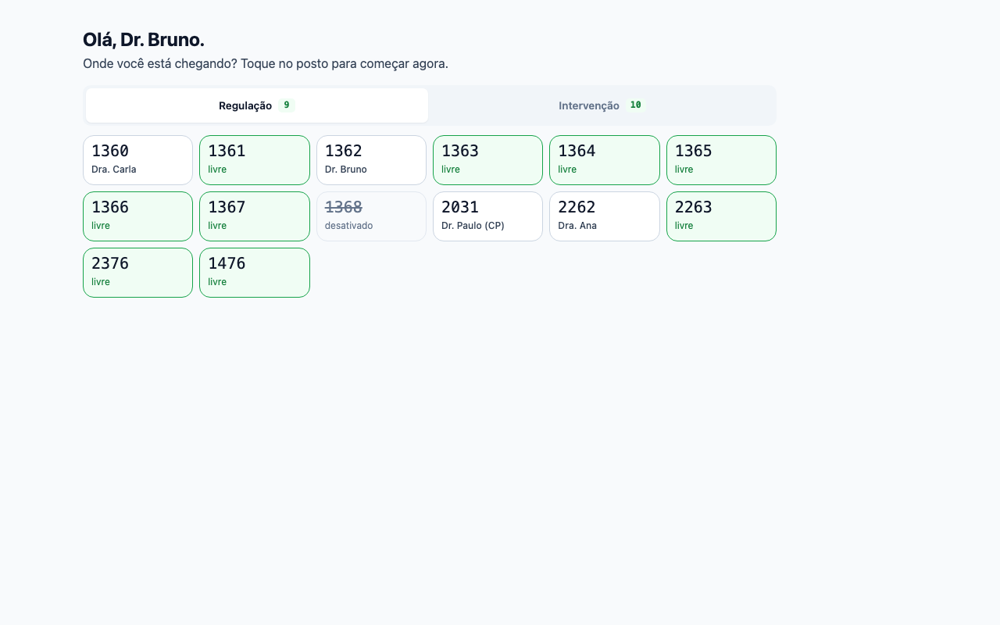
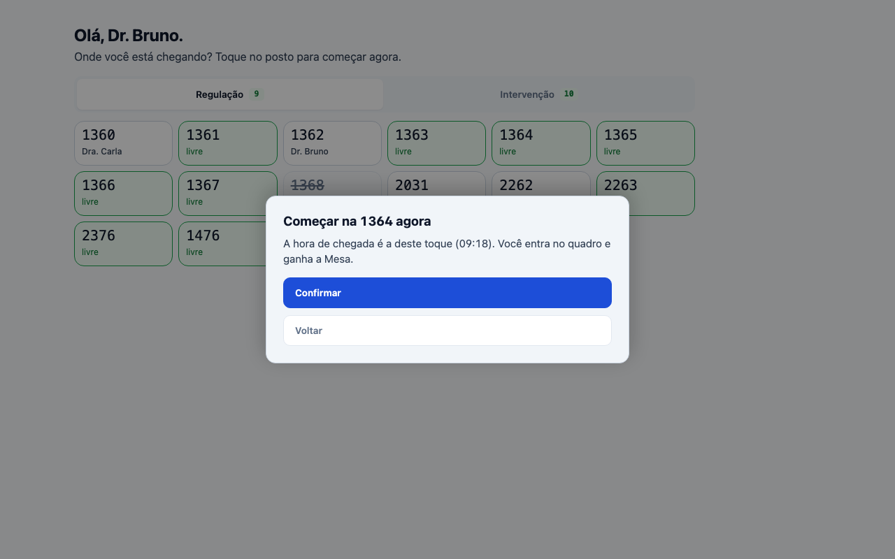
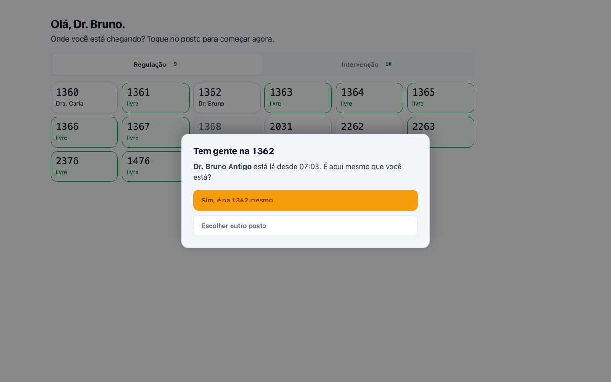
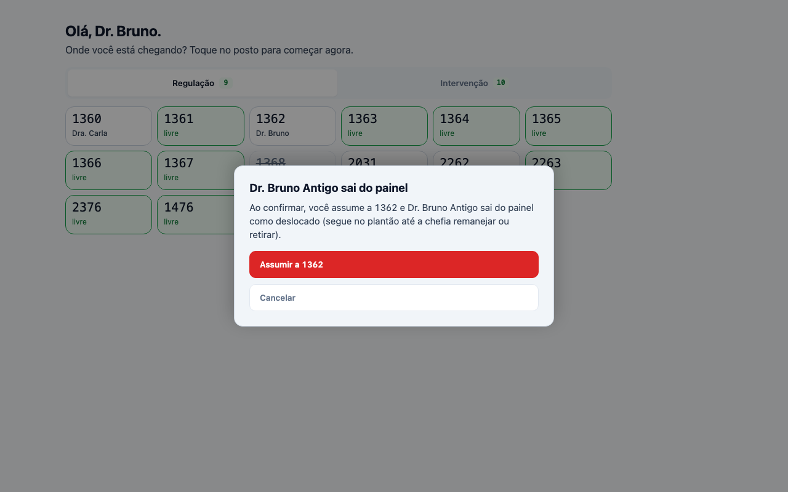
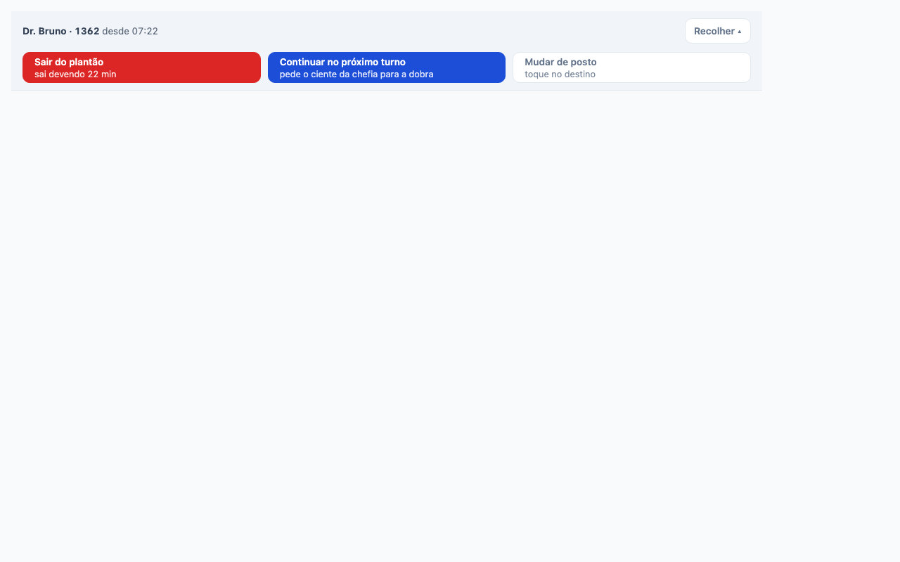
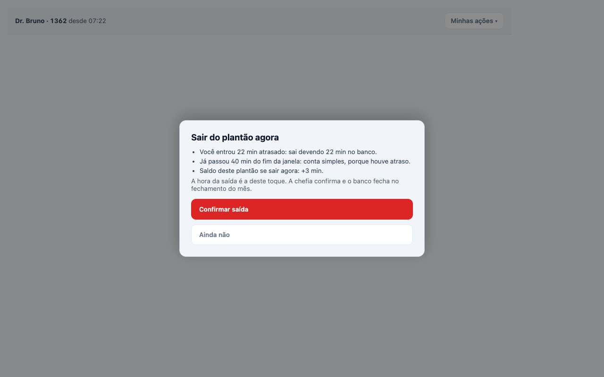
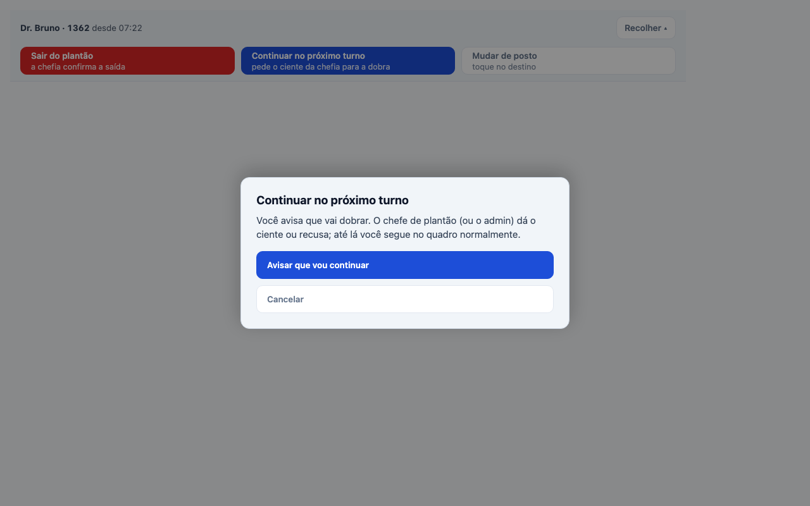
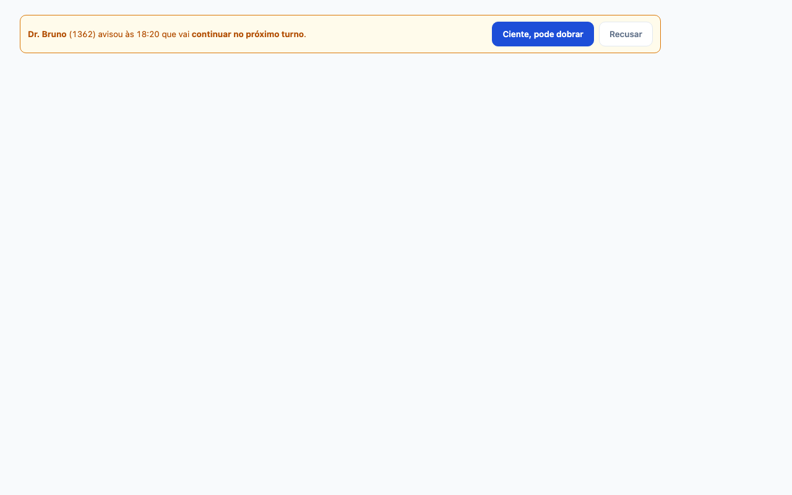
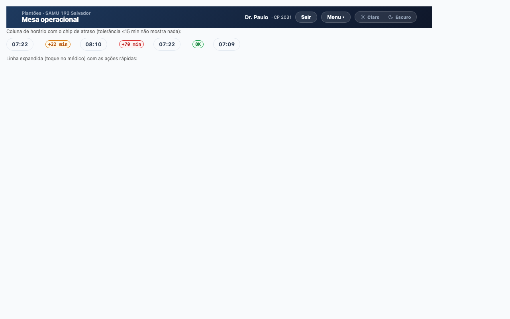
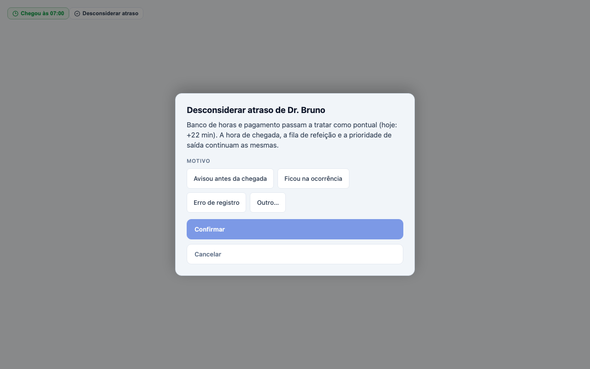

# Tutorial — chegada, saída e dobra pela Mesa (roteiro de gravação)

Roteiro para gravar a tela. Cada passo tem o que mostrar, o que falar e a
captura de referência (geradas dos componentes reais, dados fictícios). Fluxo
em produção desde 01/10/2026 (`plantoes.mnrs.com.br`).

Público: médico plantonista (conta com papel `doctor` e médico vinculado) e
chefe de plantão (quem está na 2031).

## Parte 1 — Plantonista: chegar (1 min)

**Passo 1 · Abrir a Mesa fora do turno.** Entrar pelo portal
(mnrs.com.br → Plantões). Fora do turno a Mesa não mostra o quadro: mostra
"Olá, Fulano. Onde você está chegando?" com os postos em azulejos.


Falar: *"Verde é livre. Cinza com nome, tem gente. Riscado, desativado. A aba
de cima troca entre Regulação e Intervenção."*

**Passo 2 · Tocar no posto e confirmar.** Tocar num azulejo verde. Abre
"Começar na 1364 agora" com a hora do toque. Confirmar.


Falar: *"A hora de chegada é a do toque. Ninguém digita hora. Se você chegou e
não avisou, a hora é a de agora mesmo."*

**Passo 3 · Já está no quadro.** A tela vira o quadro ao vivo (só leitura)
com uma faixa no topo: "Fulano · 1364 desde 07:03" e o botão "Minhas ações".

### Caso: o posto tem gente

**Passo 4 · Primeira confirmação.** Tocar num azulejo com nome. Pergunta "Tem
gente na 1362. Fulano está lá desde 07:03. É aqui mesmo que você está?".


**Passo 5 · Segunda confirmação.** "Fulano sai do painel" (regulação: o outro
vira deslocado, segue no plantão até a chefia resolver) ou "A base fica com
dois médicos" (USA: dupla, ninguém sai). Botão vermelho "Assumir a 1362".


Falar: *"Duas confirmações de propósito. Se não é você que está lá, escolha
outro posto."*

## Parte 2 — Plantonista: durante e no fim do turno (1 min)

**Passo 6 · Minhas ações.** Na faixa do topo, "Minhas ações" abre três botões:
Sair do plantão, Continuar no próximo turno, Mudar de posto.


**Passo 7 · Sair.** "Sair do plantão" mostra a prévia do banco antes de
confirmar: quanto deve se atrasou, se o excedente conta em dobro (pontual) ou
simples (atrasou), e o saldo deste plantão. A saída fica a confirmar pela
chefia.


Falar: *"O sistema já diz: entrou 22 min atrasado, sai devendo 22. Passou 40
min do fim, conta simples porque houve atraso. Sem conta de cabeça."*

**Passo 8 · Continuar (dobra).** "Continuar no próximo turno" manda um pedido
para a chefia. Você segue no quadro; a chefia dá o ciente ou recusa.


**Passo 9 · Mudar de posto.** Mesmo seletor de azulejos. A chegada no novo
posto é agora; a hora prevista do turno continua a do posto onde chegou.

## Parte 3 — Chefe de plantão (1 min)

**Passo 10 · Ciente da dobra.** Na Mesa do chefe aparece a faixa amarela
"Fulano (1362) avisou às 18:20 que vai continuar no próximo turno" com
"Ciente, pode dobrar" e "Recusar". Ciente cria a continuação.


**Passo 11 · Atraso visível.** Ao lado da hora de chegada: `+22 min` (âmbar),
`+70 min` (vermelho), nada até 15 min, `OK` quando desconsiderado.


**Passo 12 · Duas correções de um toque.** Tocar no médico abre a linha com
"Chegou às 07:00" (corrige a hora: vale para refeição e saída também) e
"Desconsiderar atraso" (banco e pagamento como pontual; hora, refeição e
saída não mudam). Motivo por chips.


Falar: *"Desconsiderar é para quem avisou antes ou ficou na ocorrência. O
chip vira um OK pequeno. Dá para desfazer em 30 min."*

## Regras que valem a pena dizer no vídeo

- Só quem está na 2031 escreve na Mesa. Outro chefe logado vê o quadro e, se
  tentar mexer, recebe "A Mesa é de Fulano agora. Se você clicar para logar na
  Mesa, vai derrubar o chefe de plantão".
- A sessão da Mesa cai às 07:15 e 19:15 se foi aberta antes da virada. O
  chefe novo entra com a própria conta.
- O nome de quem está logado fica sempre na barra, com o botão Sair.

## Como regravar as capturas

```bash
node --import tsx --import ./.telas-tmp/register.mjs ./.telas-tmp/render.tsx <pasta-saída>
```

O script de render vive fora do repo (scratchpad da sessão de 01/10/2026);
renderiza `PainelDoPlantonista`, `SeletorDePosto`, `AcoesDeAtraso`,
`ModalChefeOutro` e `PedidosDoMedicoRail` com `renderToStaticMarkup` e os
CSS reais, e fotografa com Chrome headless. Os componentes aceitam
`estadoInicial`/`passoInicial`/`folhaInicial`/`mensagemInicial` para isso.
